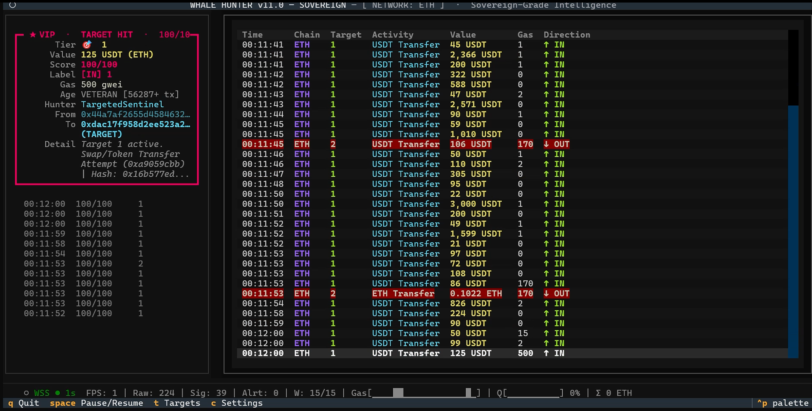

<div align="center">

<!-- ─── Banner / Logo placeholder ─── -->
<!-- Replace docs/banner.png with your own artwork before publishing -->


# 🐋 WHALE HUNTER

### Sovereign-Grade Ethereum Sentinel  ·  v11.0 — SOVEREIGN

```text
██╗    ██╗██╗  ██╗ █████╗ ██╗     ███████╗    ██╗  ██╗██╗   ██╗███╗   ██╗████████╗███████╗██████╗
██║    ██║██║  ██║██╔══██╗██║     ██╔════╝    ██║  ██║██║   ██║████╗  ██║╚══██╔══╝██╔════╝██╔══██╗
██║ █╗ ██║███████║███████║██║     █████╗      ███████║██║   ██║██╔██╗ ██║   ██║   █████╗  ██████╔╝
██║███╗██║██╔══██║██╔══██║██║     ██╔══╝      ██╔══██║██║   ██║██║╚██╗██║   ██║   ██╔══╝  ██╔══██╗
╚███╔███╔╝██║  ██║██║  ██║███████╗███████╗    ██║  ██║╚██████╔╝██║ ╚████║   ██║   ███████╗██║  ██║
 ╚══╝╚══╝ ╚═╝  ╚═╝╚═╝  ╚═╝╚══════╝╚══════╝    ╚═╝  ╚═╝ ╚═════╝ ╚═╝  ╚═══╝   ╚═╝   ╚══════╝╚═╝  ╚═╝
```

[](https://www.gnu.org/licenses/gpl-3.0)
[](https://www.python.org/)
[](#-installation)
[](https://aur.archlinux.org/packages/whale-hunter)
[](https://textual.textualize.io/)
[](https://github.com/GIN-SYSTEMS/whale-hunter/stargazers)

> **Stop being the product. Start being the observer.**
> A zero-latency, privacy-first mempool sentinel that runs on **your** hardware, under **your** rules — no Arkham subscription, no Etherscan rate limit, no analytics broker between you and the chain.

</div>

---

<div align="center">

<!-- ─── Animated TUI demo placeholder ─── -->
<!-- Drop a recorded GIF at docs/demo.gif (asciinema → agg works perfectly) -->


*↑ Live mempool sentinel. Brutalist Textual TUI. Sub-10 ms decode. Runs on a 1 vCPU VPS.*

</div>

---

## ⚡ Why Whale Hunter?

Centralised on-chain dashboards (Arkham, Nansen, Etherscan, Dune, Whale Alert) make you a **passive consumer** of pre-digested intelligence. They decide what counts as a whale. They throttle your queries. They watch what you watch. They sit between you and the truth.

**Whale Hunter inverts the relationship.** It runs on your laptop, your VPS, or your air-gapped intelligence node. You point it at the WSS endpoint of your choice — Alchemy, Infura, QuickNode, Ankr, Chainstack, your own Geth, your own Erigon — and it decodes the mempool **directly**, in real time, with no middleman. Your watchlist never leaves your machine. Your API key is encrypted at rest. Your alerts go where **you** tell them to go.

|                              | Centralised dashboards | Whale Hunter |
| ---------------------------- | :--------------------: | :----------: |
| Operator owns the data       |          ✗             |      ✓       |
| Custom watchlist privacy     |          ✗             |      ✓       |
| Sub-second mempool latency   |          ✗             |      ✓       |
| Provider-neutral (any WSS)   |          ✗             |      ✓       |
| Encrypted credentials at rest|          ✗             |      ✓       |
| Runs offline / air-gapped    |          ✗             |      ✓       |
| Free + open source (GPLv3)   |          ✗             |      ✓       |

---

## ✨ Key Features

### 🛡️ Sovereign Vault
Sensitive credentials (provider URLs, Telegram tokens) are encrypted at rest with **AES-128 / Fernet** under a vault key stored at `~/.config/whale-hunter/vault.key` (POSIX `0600`) or `%APPDATA%\whale-hunter\vault.key` (Windows). The `.env` ships ciphertext only. The setup wizard handles the encryption transparently — you never edit raw secrets.

### 🌐 Dual-Pump WSS Engine — No Vendor Lock-In
The transport autodetects the provider from the URL and picks the optimal pending-tx subscription verb:

* **Alchemy mode** — `alchemy_pendingTransactions` delivers the full transaction body in the subscription event. Fastest path.
* **Standard mode** — `newPendingTransactions` (works on every JSON-RPC node: Infura, QuickNode, Ankr, Chainstack, BlastAPI, GetBlock, LlamaNodes, PublicNode, Geth, Erigon, Nethermind, Reth, self-hosted). Whale Hunter dispatches `eth_getTransactionByHash` over the same socket and reshapes the response into the unified internal format. Zero downstream code changes.

#### 🔁 HTTPS or WSS? Paste either — we handle the rest.

The mempool ingestor needs a **streaming** connection, so the transport itself always negotiates WSS at the protocol level. But that does **not** mean you have to find the WSS URL on your provider dashboard. Every major provider exposes the same endpoint under both schemes:

```
HTTPS form  :  https://eth-mainnet.g.alchemy.com/v2/<YOUR_KEY>
WSS form    :  wss://eth-mainnet.g.alchemy.com/v2/<YOUR_KEY>
```

**Paste whichever your provider hands you.** The setup wizard auto-rewrites:

| You paste              | We negotiate    |
| :--------------------- | :-------------- |
| `https://...`          | `wss://...`     |
| `http://...`           | `ws://...`      |
| `wss://...`            | `wss://...` (untouched) |
| `ws://...`             | `ws://...` (untouched)  |

Most operators don't even realise their provider also speaks WSS — Whale Hunter discovers it for them automatically.

Plus: **fallback URL rotation** via `WSS_FALLBACK_URLS` — primary endpoint dies, we hop to the next without operator intervention.

### 🎯 Live Hot-Reload Watchlist
Press `t` in the TUI, paste an address, hit Enter. The new target propagates to the running multiprocessing pool **in microseconds** via a shared `multiprocessing.Manager().dict()` + atomic version counter — **no app restart, no WSS reconnect, no in-flight transactions lost.** A visible toast confirms the propagation: `Hot-reload OK · 7 target(s) · v=12`.

### 🔕 Sovereign Notification Shield
The TUI shows the firehose, **silently**. The OS tray stays quiet by default. Opt in with `OS_NOTIFICATIONS_ENABLED=1` and even then the shield only fires for:
1. **VIP-flagged hits** (operator-curated watchlist)
2. **OR transactions ≥ 100 ETH** (configurable)

…throttled to **one fire per 10 seconds** maximum. No matter how busy the mempool gets, your tray never floods. Backends: `winotify` (Windows), `osascript` (macOS), `notify-send` (Linux).

### 🚀 Multi-Process Architecture
Per-chain ingestor processes feed a shared transaction queue; a worker pool of `cpu_count - 1` hunters runs the heuristic engines in parallel. Lock-free `mp.Value` counters expose live throughput to the TUI without contention. Survives single-process crashes — the watchdog respawns ingestors after 5 min of WSS silence.

### 🎨 Brutalist Textual TUI
60 + FPS render, no X11/Wayland required. Pause/resume the firehose, inspect any signal in a modal, archive the buffer, switch between Radar / Archive / Analytics views with `1` / `2` / `3`. All keystroke-driven.

### 📡 Provider-Agnostic Telemetry & Alerts
Every signal can fan out to:
- The TUI (always, silent)
- Telegram (encrypted bot token, throttled, VIP-aware)
- Optional ClickHouse persistence (`USE_CLICKHOUSE=1`)
- The OS notification tray (gated by the Shield)

---

## 🏗️ Architecture

```
                  ┌─────────────────────────────┐
                  │  WSS Provider (any)         │
                  │  Alchemy · Infura ·         │
                  │  QuickNode · Ankr · Geth    │
                  └──────────────┬──────────────┘
                                 │
                  ┌──────────────▼──────────────┐
                  │ Ingestor Process (per chain)│
                  │  • Provider auto-detect     │
                  │  • Dual-pump (Alchemy/Std)  │
                  │  • Fallback URL rotation    │
                  │  • parse_tx → Transaction   │
                  └──────────────┬──────────────┘
                                 │
                  ┌──────────────▼──────────────┐
                  │  mp.Queue[Transaction]      │
                  └──────────────┬──────────────┘
                                 │
                  ┌──────────────▼──────────────┐
                  │  Hunter Worker Pool         │
                  │  • TargetedSentinel         │
                  │  • Live Targets (Manager)   │ ◀── Hot-reload
                  │  • Lock-free version snap   │     from UI
                  └──────────────┬──────────────┘
                                 │
                  ┌──────────────▼──────────────┐
                  │  mp.Queue[Signal]           │
                  └──────────────┬──────────────┘
                                 │
                  ┌──────────────▼──────────────┐
                  │  Bridge thread → asyncio    │
                  └──────────────┬──────────────┘
                                 │
              ┌──────────────────┼──────────────────┐
              │                  │                  │
       ┌──────▼──────┐    ┌──────▼──────┐    ┌──────▼──────┐
       │ Textual TUI │    │  Telegram   │    │ Notification│
       │  (firehose) │    │  Alerter    │    │   Shield    │
       │             │    │ (VIP/200ETH)│    │ (OS · gated)│
       └─────────────┘    └─────────────┘    └─────────────┘
```

**Key invariants:**
- The ingestor is the only component that holds the WSS connection. Everything else is async-loop or worker-pool downstream.
- No process is restarted on watchlist mutation — shared state propagation only.
- All persistence is opt-in. Default boot is in-memory, instant.
- Credentials never appear in plaintext on disk.

---

## 📥 Installation

### 🪟 Windows — Pre-Compiled `.exe` (easiest)

Grab the standalone executable from the releases page:

➡️ **[Download Latest Release](https://github.com/GIN-SYSTEMS/whale-hunter/releases)**

```powershell
# Run the .exe directly — first launch opens the setup wizard.
.\whale-hunter-v11.exe
```

> 🛡️ **First-run note:** Windows Defender may flag the binary (false positive — common for PyInstaller). The release page hash-pins every artifact; verify with `Get-FileHash`. If you prefer, build from source — see below.

### 🐧 Arch Linux — AUR

```bash
# Using yay
yay -S whale-hunter

# Using paru
paru -S whale-hunter

# Manual build
git clone https://aur.archlinux.org/whale-hunter.git
cd whale-hunter && makepkg -si
```

After install, the binary is on `$PATH`:

```bash
whale-hunter --setup    # one-time configuration wizard
whale-hunter            # launch the TUI
```

### 🐧 Ubuntu / Debian / Fedora / any Linux — Python install

```bash
# 1. Clone
git clone https://github.com/GIN-SYSTEMS/whale-hunter.git
cd whale-hunter

# 2. Create a virtualenv (recommended)
python3 -m venv .venv
source .venv/bin/activate

# 3. Install with all optional accelerators
pip install -r requirements.txt
pip install orjson psutil uvloop          # optional speedups
pip install winotify                      # only if you also build for Windows

# 4. First-run setup wizard
python main.py --setup

# 5. Launch the sentinel
python main.py
```

### 🍎 macOS

```bash
brew install python@3.12 tmux
git clone https://github.com/GIN-SYSTEMS/whale-hunter.git
cd whale-hunter
python3 -m venv .venv && source .venv/bin/activate
pip install -r requirements.txt
python main.py --setup
python main.py
```

### 📦 As a `pip` package (any platform)

```bash
pip install whale-hunter        # once published to PyPI
whale-hunter --setup
whale-hunter
```

---

## ⚙️ Configuration

The setup wizard writes `.env` for you, but here's the manual layout:

```dotenv
# Provider endpoint — paste the WSS *or* the HTTPS URL your provider gave you.
# Whale Hunter auto-rewrites https:// → wss:// at connection time, so either
# scheme works. No vendor lock-in: any standard JSON-RPC node is supported.
WSS_URL=YOUR_WSS_OR_HTTPS_URL_HERE

# Subscription mode: auto | alchemy | standard
#   auto      → autodetect from hostname (alchemy.com → Alchemy mode, else Standard)
#   alchemy   → force alchemy_pendingTransactions (full body in subscription event)
#   standard  → force newPendingTransactions (works on Infura, QuickNode, Ankr,
#               Chainstack, Geth, Erigon, anywhere — body fetched via
#               eth_getTransactionByHash over the same socket)
WSS_SUBSCRIPTION_METHOD=auto

# Optional fallback URLs (CSV) — auto-rotated on auth/network/timeout failure.
# WSS_FALLBACK_URLS=wss://mainnet.infura.io/ws/v3/YOUR_KEY,wss://eth.llamarpc.com
WSS_FALLBACK_URLS=

# Telegram alerting (optional). Both fields required for delivery.
TELEGRAM_BOT_TOKEN=YOUR_TELEGRAM_BOT_TOKEN
TELEGRAM_CHAT_ID=YOUR_TELEGRAM_CHAT_ID
TELEGRAM_ENABLED=0

# OS desktop notification shield — DEFAULT OFF for quiet operation.
# When ENABLED=1, fires only for VIP-flagged hits OR transactions >= MIN_ETH,
# throttled to one per THROTTLE_SEC. The TUI is unaffected — full firehose.
OS_NOTIFICATIONS_ENABLED=0
OS_NOTIFY_MIN_ETH=100
OS_NOTIFY_THROTTLE_SEC=10

# Heuristic thresholds (adjustable from the in-TUI Settings modal too)
WHALE_THRESHOLD_ETH=100
ALERT_SCORE_THRESHOLD=80
```

Sensitive fields (`WSS_URL`, `TELEGRAM_BOT_TOKEN`) are encrypted to `ENC:…` ciphertext by the wizard before being written. Plain values still work — useful for headless / CI deployments.

📂 Full annotated schema: [`.env.example`](.env.example)

---

## 🎮 Hotkeys

| Key | Action |
| :--: | :--- |
| `t` | Open the **Target Command Center** (add/remove watched wallets) |
| `c` | Open the **Configuration** modal (rotate WSS / Telegram credentials) |
| `i` | Open the **Signal Archive** (full history with inspection) |
| `f` | Set / clear the volume filter |
| `Space` / `p` | Pause / resume the firehose (buffer keeps filling) |
| `:` or `/` | Open the **Quick Command Palette** |
| `*` | Help screen |
| `q` | Quit gracefully |
| `1` `2` `3` | Switch view: Radar · Archive · Analytics |

---

## 🛡️ 24/7 Headless Deployment

Whale Hunter is engineered to be left running. Forever. Pair it with `tmux` (or `screen`) on a VPS for true sovereign operation:

```bash
# Open a persistent named session
tmux new -s whale-hunter
whale-hunter        # or: python main.py

# Detach: Ctrl+B then D     (sentinel keeps running)
# Reattach: tmux attach -t whale-hunter
```

Boot-resilient setup with `systemd`:

```ini
# /etc/systemd/system/whale-hunter.service
[Unit]
Description=Whale Hunter — Sovereign-Grade Mempool Sentinel
After=network-online.target
Wants=network-online.target

[Service]
Type=forking
User=hunter
WorkingDirectory=/opt/whale-hunter
ExecStart=/usr/bin/tmux new-session -d -s whale-hunter \
          '/opt/whale-hunter/.venv/bin/python main.py --headless'
ExecStop=/usr/bin/tmux kill-session -t whale-hunter
Restart=always
RestartSec=10

[Install]
WantedBy=multi-user.target
```

```bash
sudo systemctl enable --now whale-hunter
sudo -u hunter tmux attach -t whale-hunter   # jump into the live TUI any time
```

This is the same operational discipline trading desks and SOC analysts use — **boot-resilient, SSH-resilient, network-resilient, inspectable on demand.**

---

## 📊 Performance

| Metric | Value |
| :--- | :--- |
| Memory footprint (steady state) | **< 150 MB** |
| Idle CPU | **1–2 %** |
| Pending-tx decode latency | **< 10 ms** (network-bound) |
| Watchlist hot-reload latency | **< 50 µs** (zero process restart) |
| Min spec for VPS | **1 vCPU, 512 MB RAM** |
| TUI render cap | **60 + FPS** |

Benchmarks run on commodity hardware (Hetzner CPX11, Linode 1GB, AWS t3.nano). The architecture is bottlenecked by your provider's WSS, not by the sentinel.

---

## 🤝 Contributing

Whale Hunter is built by sovereign developers, for sovereign developers. PRs that respect the operating doctrine are welcome:

* **Privacy first** — never introduce a phone-home, telemetry, or third-party SDK.
* **Provider-neutral** — every new feature must work on a self-hosted Geth node, not just Alchemy.
* **TUI-only** — no Electron, no web wrapper, no GUI bloat.
* **Type-clean** — `python -m py_compile` must pass; tests where they make sense.

Workflow:

```bash
git clone https://github.com/GIN-SYSTEMS/whale-hunter.git
cd whale-hunter
python3 -m venv .venv && source .venv/bin/activate
pip install -r requirements.txt
git checkout -b feature/your-idea
# … hack, test, commit …
git push origin feature/your-idea
# Open a PR against main with a clear description.
```

Bug reports and feature requests live in [GitHub Issues](https://github.com/GIN-SYSTEMS/whale-hunter/issues).

---

## ⚖️ License

Distributed under the **GNU General Public License v3**.
You are free to run, study, modify, and redistribute the software — provided derivative works remain GPLv3.
See [`LICENSE`](LICENSE) for the full text.

---

## 🙏 Acknowledgments

* [**Textual**](https://textual.textualize.io/) — the brutalist render engine that makes the TUI possible.
* [**websockets**](https://websockets.readthedocs.io/) — async WSS plumbing.
* [**httpx**](https://www.python-httpx.org/) — non-blocking HTTP for the Telegram alerter.
* [**cryptography**](https://cryptography.io/) — Fernet vault primitives.
* The Ethereum forensics community — DOJ, BKA, NCA — for publishing seizure addresses we use as known dormant heuristics.

---

<div align="center">

**[⭐ Star this repo](https://github.com/GIN-SYSTEMS/whale-hunter/stargazers)** if Whale Hunter saved you a subscription fee.
**[🐛 Open an issue](https://github.com/GIN-SYSTEMS/whale-hunter/issues)** if it didn't.

*Architected by [GIN-SYSTEMS](https://github.com/GIN-SYSTEMS)  ·  © 2026 Whale Hunter Contributors  ·  All systems operational.*

</div>
